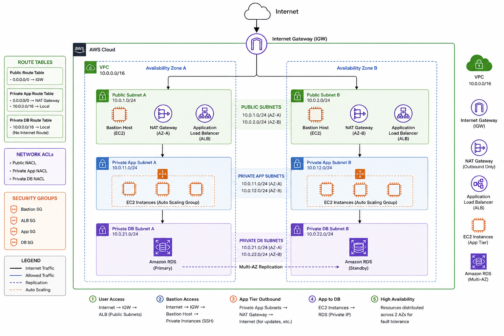
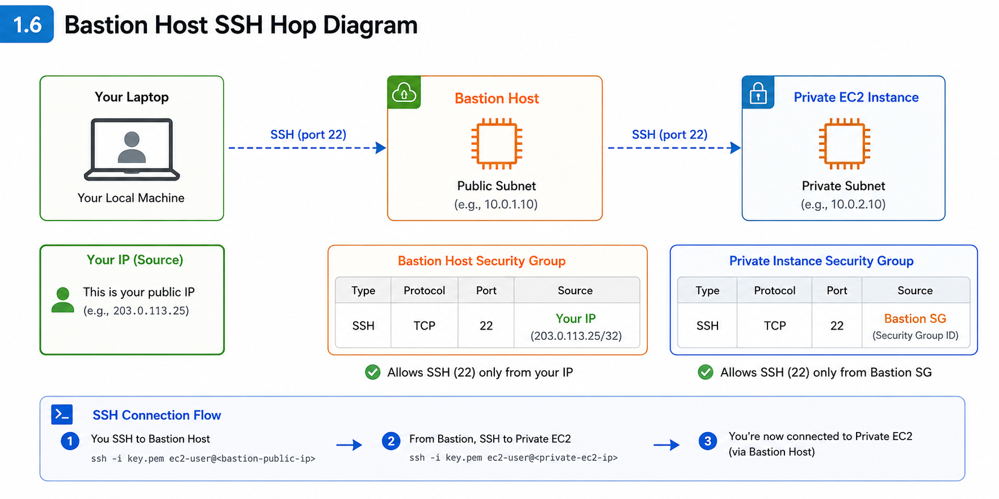
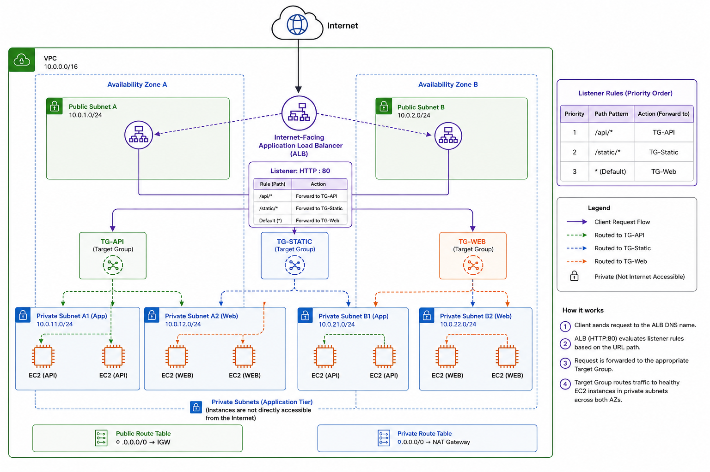
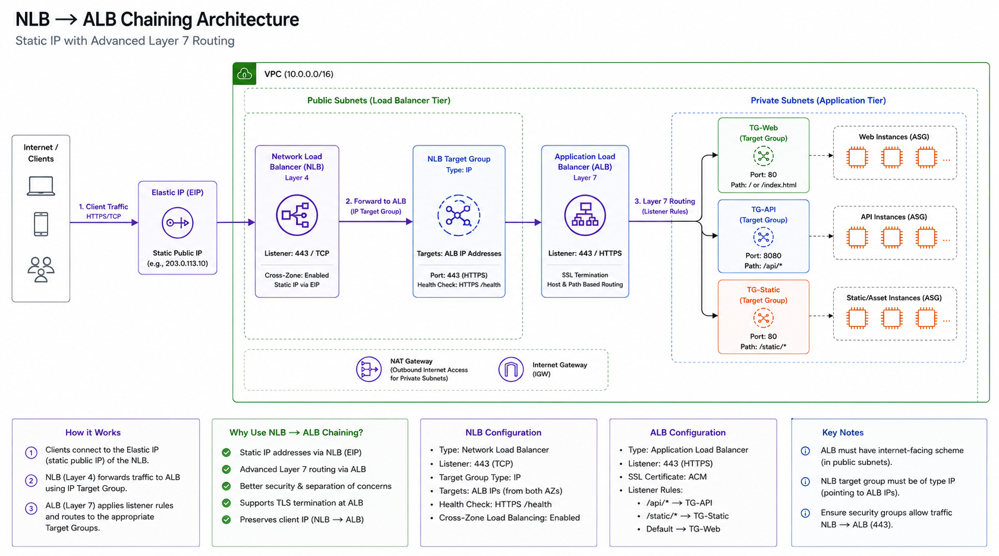

# AWS Infrastructure Guide
### VPC · Route 53 · EC2 · Load Balancers · ACM · Auto Scaling


---

## Table of Contents

1. [VPC & Networking](#1-vpc--networking)
2. [Route 53 – DNS Management](#2-route-53--dns-management)
3. [EC2 – Instances, Security Groups, Storage](#3-ec2--instances-security-groups--storage)
4. [Load Balancers – ALB & NLB](#4-load-balancers--alb--nlb)
   - [ALB vs NLB Comparison](#alb-vs-nlb--feature-comparison)
   - [NLB → ALB Chaining](#45-nlb--alb-chaining-advanced-pattern)
5. [ACM – SSL/TLS Certificates](#5-acm--ssltls-certificates)
6. [Auto Scaling Groups](#6-auto-scaling-groups)

---

# 1. VPC & Networking

## 1.1 What is a VPC?

A **Virtual Private Cloud (VPC)** is a logically isolated network you define inside AWS. Think of it as your own private data center in the cloud — you control IP ranges, subnets, route tables, [...]

**Key components at a glance:**

| Component | Purpose |
|---|---|
| VPC | The isolated network boundary |
| Public Subnet | Resources accessible from the internet (e.g., load balancers, bastion hosts) |
| Private Subnet | Resources NOT directly reachable from internet (e.g., app servers, databases) |
| Internet Gateway (IGW) | Allows traffic between public subnets and the internet |
| NAT Gateway | Lets private subnet resources initiate outbound internet connections (no inbound) |
| Bastion Host | A jump server in the public subnet used to SSH into private instances |
| Route Table | Rules that determine where network traffic is directed |
| NACL | Stateless firewall at the subnet level |

## 1.2 Why Do You Need a VPC?

- **Security isolation** – your resources are not on a shared flat network
- **Network segmentation** – separate public-facing tiers from private application/database tiers
- **Compliance** – restrict data to specific regions and control all traffic flow
- **Cost control** – NAT Gateway lets private instances pull patches/updates without exposing them

## 1.3 Architecture – 3-Tier App in a VPC



```
Internet
    │
    ▼
Internet Gateway (IGW)
    │
    ▼
┌─────────────────────────────────────┐
│  VPC  (e.g. 10.0.0.0/16)           │
│                                     │
│  ┌─────────────┐  ┌─────────────┐  │
│  │ Public Sub  │  │ Public Sub  │  │
│  │  AZ-1a      │  │  AZ-1b      │  │
│  │ (10.0.1.0/24)│  │(10.0.2.0/24)│  │
│  │ Bastion Host│  │  ALB        │  │
│  │ NAT Gateway │  │             │  │
│  └──────┬──────┘  └──────┬──────┘  │
│         │                │         │
│  ┌──────▼──────┐  ┌──────▼──────┐  │
│  │ Private Sub │  │ Private Sub │  │
│  │  AZ-1a      │  │  AZ-1b      │  │
│  │ App Servers │  │ App Servers │  │
│  └──────┬──────┘  └──────┬──────┘  │
│         │                │         │
│  ┌──────▼──────┐  ┌──────▼──────┐  │
│  │ Private Sub │  │ Private Sub │  │
│  │  AZ-1a (DB) │  │  AZ-1b (DB) │  │
│  └─────────────┘  └─────────────┘  │
└─────────────────────────────────────┘
```


---

## 1.4 Step-by-Step: Create a VPC with Subnets

### Step 1 – Create the VPC

1. Open **AWS Console → VPC → Your VPCs → Create VPC**
2. Choose **VPC and more** (this pre-creates subnets, route tables, and IGW)
3. Set:
   - **Name tag:** `my-app-vpc`
   - **IPv4 CIDR block:** `10.0.0.0/16`
   - **Number of AZs:** 2
   - **Number of public subnets:** 2
   - **Number of private subnets:** 4 *(2 for app tier + 2 for DB tier)*
   - **NAT Gateways:** 1 per AZ (for production) or 1 (to save cost in dev)
   - **VPC endpoints:** S3 (optional, recommended)
4. Click **Create VPC**


### Step 2 – Verify Subnets

1. Go to **VPC → Subnets**
2. Confirm you have subnets in both AZs (e.g., `us-east-1a` and `us-east-1b`)
3. Tag subnets clearly:
   - `public-subnet-1a`, `public-subnet-1b`
   - `private-app-subnet-1a`, `private-app-subnet-1b`
   - `private-db-subnet-1a`, `private-db-subnet-1b`

### Step 3 – Verify Route Tables

1. Go to **VPC → Route Tables**
2. **Public Route Table** should have:
   - `0.0.0.0/0 → igw-xxxxxxxx` (Internet Gateway)
3. **Private Route Table** should have:
   - `0.0.0.0/0 → nat-xxxxxxxx` (NAT Gateway)
4. Associate each route table with the correct subnets via the **Subnet Associations** tab


---

## 1.5 Step-by-Step: Create a NAT Gateway

> NAT Gateway allows private subnet EC2 instances to reach the internet (for software updates, API calls) without being reachable from the internet.

1. Go to **VPC → NAT Gateways → Create NAT Gateway**
2. Set:
   - **Name:** `my-nat-gateway`
   - **Subnet:** Choose a **public subnet** (e.g., `public-subnet-1a`) — *NAT Gateway must live in a public subnet*
   - **Connectivity type:** Public
   - **Elastic IP:** Click **Allocate Elastic IP**
3. Click **Create NAT Gateway** (takes ~1–2 minutes to become available)
4. Update the **private route table**: add route `0.0.0.0/0 → nat-xxxxxxxx`

---

## 1.6 Step-by-Step: Create a Bastion Host



> A Bastion Host (Jump Box) is a small EC2 instance in the public subnet that acts as the secure entry point to SSH into private instances.

1. Launch an EC2 instance (see Section 3) in the **public subnet**
2. Use a small instance type: `t3.micro`
3. AMI: **Amazon Linux 2**
4. **Security Group** for Bastion: Allow inbound **SSH (port 22)** only from **your IP address** (`My IP`)
5. Give it an **Elastic IP** (so the IP doesn't change on restart)
6. To connect to a private instance via bastion:
   ```bash
   # On your local machine
   ssh -A -i your-key.pem ec2-user@<bastion-public-ip>
   
   # Then from bastion, SSH into private instance
   ssh ec2-user@<private-instance-ip>
   ```


---

## 1.7 Step-by-Step: Create a NACL (Network ACL)

> NACLs are stateless subnet-level firewalls. Unlike Security Groups (stateful), you must explicitly allow both inbound AND outbound traffic.

1. Go to **VPC → Network ACLs → Create Network ACL**
2. Name it (e.g., `private-nacl`) and select your VPC
3. Click **Create**
4. Add **Inbound Rules** (example for private app subnet):

| Rule # | Type | Protocol | Port | Source | Allow/Deny |
|--------|------|----------|------|--------|------------|
| 100 | HTTP | TCP | 80 | 10.0.0.0/16 | Allow |
| 110 | HTTPS | TCP | 443 | 10.0.0.0/16 | Allow |
| 120 | SSH | TCP | 22 | 10.0.1.0/24 (Bastion) | Allow |
| 32767 | Custom | All | All | 0.0.0.0/0 | Deny |

5. Add **Outbound Rules** (NACLs are stateless — you must allow return traffic):

| Rule # | Type | Protocol | Port | Destination | Allow/Deny |
|--------|------|----------|------|-------------|------------|
| 100 | Custom | TCP | 1024-65535 | 0.0.0.0/0 | Allow |
| 32767 | All | All | All | 0.0.0.0/0 | Deny |

6. Associate the NACL with the correct subnets via **Subnet Associations** tab

> **NACL vs Security Group:**
> - Security Groups are **stateful** (return traffic is automatic)
> - NACLs are **stateless** (you must allow return traffic explicitly)
> - Security Groups operate at the **instance** level; NACLs at the **subnet** level

---

# 2. Route 53 – DNS Management

## 2.1 What is Route 53?

**Amazon Route 53** is AWS's scalable DNS (Domain Name System) service. It translates human-readable domain names (like `example.com`) into IP addresses.

**Key concepts:**

| Term | Meaning |
|------|---------|
| Hosted Zone | Container for DNS records for a domain |
| Record | Maps a name to a value (e.g., A record → IP address) |
| Nameserver (NS) | Tells the internet which DNS servers are authoritative for your domain |
| Routing Policy | Controls how Route 53 responds to queries |

**Record Types:**

| Type | Use Case |
|------|----------|
| **A** | Maps domain → IPv4 address |
| **AAAA** | Maps domain → IPv6 address |
| **CNAME** | Maps domain → another domain name (not for root domain) |
| **Alias** | Like CNAME, but works for root domain & AWS resources (ALB, CloudFront, etc.) |
| **MX** | Mail server records |
| **TXT** | Verification records (SSL, SPF, DKIM) |
| **NS** | Nameserver records (auto-created with hosted zone) |

**Routing Policies:**

| Policy | Use Case |
|--------|----------|
| Simple | Single resource, no logic |
| Weighted | Split traffic by percentage (A/B testing, blue-green) |
| Latency | Route to the region with lowest latency |
| Failover | Active/passive — route to backup if primary fails |
| Geolocation | Route based on user's geographic location |
| Geoproximity | Route based on location + bias (requires Traffic Flow) |
| Multivalue Answer | Return multiple IPs with health checks |

## 2.2 Why Do You Need Route 53?

- Route custom domains to your AWS resources (ALB, EC2, CloudFront, S3)
- Manage subdomains (api.example.com, admin.example.com)
- Health-check-based failover for high availability
- Latency-based routing for global apps

---

## 2.3 Step-by-Step: Create a Hosted Zone

1. Go to **Route 53 → Hosted Zones → Create Hosted Zone**
2. Set:
   - **Domain name:** `example.com` (your domain, replace with yours)
   - **Type:** Public Hosted Zone
3. Click **Create Hosted Zone**
4. AWS automatically creates two records:
   - **NS record** — 4 nameserver addresses (you'll use these in Step 2.4)
   - **SOA record** — Start of Authority


---

## 2.4 Step-by-Step: Update GoDaddy Nameservers to AWS

1. In Route 53, copy the **4 nameserver values** from the NS record (they look like `ns-123.awsdns-45.com`)
2. Log in to **GoDaddy → My Products → DNS → Manage**
3. Find **Nameservers → Change → I'll use my own nameservers**
4. Enter all 4 AWS nameservers (remove the trailing dot if present)
5. Save — DNS propagation takes **24–48 hours** (often faster)
6. Test propagation:
   ```bash
   nslookup -type=NS example.com
   # or
   dig NS example.com
   ```


---

## 2.5 Step-by-Step: Create DNS Records with Routing Policies

### Simple Record (point domain to ALB)

1. **Route 53 → Hosted Zones → example.com → Create Record**
2. Set:
   - **Record name:** *(leave blank for root domain)*
   - **Record type:** A
   - **Alias:** Toggle ON
   - **Route traffic to:** Alias to Application and Classic Load Balancer
   - **Region:** Your region
   - **Load balancer:** Select your ALB
   - **Routing policy:** Simple
3. Click **Create records**

### Weighted Routing (A/B testing)

1. Create Record → `app.example.com` → A → Alias to ALB-v1
   - **Routing policy:** Weighted
   - **Weight:** 80
   - **Record ID:** `v1`
2. Create another record → same name → Alias to ALB-v2
   - **Weight:** 20
   - **Record ID:** `v2`

### Failover Routing

1. First, create a **Health Check** for your primary resource:
   - **Route 53 → Health Checks → Create Health Check**
   - Type: HTTP (or HTTPS, TCP, CloudWatch Alarm)
   - Protocol: HTTPS, Port: 443, Path: `/health` or `/`
   - Interval: 30 seconds (standard)
   - Failure threshold: 3 consecutive failures = unhealthy
2. Create **Primary** record:
   - `api.example.com` → A → Alias to primary ALB
   - Routing policy: Failover → **Primary**
   - **Health check:** Attach the health check created in Step 1
3. Create **Secondary** record:
   - Same name → Alias to backup resource
   - Routing policy: Failover → **Secondary**
   - No health check needed (only used if primary fails)

### Subdomain Records

| Subdomain | Type | Points To |
|-----------|------|-----------|
| `api.example.com` | A (Alias) | Internal ALB |
| `admin.example.com` | A (Alias) | CloudFront |
| `mail.example.com` | MX | Mail server |
| `www.example.com` | CNAME | `example.com` |

---

## 2.6 Step-by-Step: DNS Failover Example (Active-Passive Setup)

**Scenario:** Your primary ALB in `us-east-1a` fails. Route 53 automatically switches traffic to your backup ALB in `us-east-1b`.

### Create Health Check for Primary ALB

1. **Route 53 → Health Checks → Create Health Check**
2. Configure:
   - **Health check type:** HTTP (or HTTPS for better security)
   - **Protocol:** HTTPS
   - **IP address or domain name:** `primary-alb-dns-name.elb.amazonaws.com`
   - **Port:** 443
   - **Path:** `/` (or `/health` if your app has a dedicated health endpoint)
   - **Request interval:** 30 seconds
   - **Failure threshold:** 3 (Route 53 marks healthy only after 3 successful checks)
3. Click **Create Health Check**

### Create Primary and Secondary Records

1. **Route 53 → Hosted Zones → example.com → Create Record**
   - **Record name:** `api` (creates `api.example.com`)
   - **Record type:** A
   - **Alias:** ON
   - **Route traffic to:** Alias to Application Load Balancer → select **primary ALB**
   - **Routing policy:** Failover
   - **Failover record type:** Primary
   - **Associate with Health Check:** Select the health check from above
   - **Click Create records**

2. **Create the same record name again (Secondary)**
   - **Record name:** `api`
   - **Record type:** A
   - **Alias:** ON
   - **Route traffic to:** Alias to Application Load Balancer → select **backup ALB**
   - **Routing policy:** Failover
   - **Failover record type:** Secondary
   - **No health check** (secondary only used if primary fails)
   - **Click Create records**

### How It Works

```
Normal State:
Client queries api.example.com
         ↓
Route 53 checks health of Primary ALB (HEALTHY)
         ↓
Traffic → Primary ALB (us-east-1a)


Failure State:
Primary ALB health check fails (3 consecutive failures = ~90 seconds)
         ↓
Route 53 detects Primary is UNHEALTHY
         ↓
Route 53 switches to Secondary ALB
         ↓
Traffic → Backup ALB (us-east-1b)
```

### Test the Failover

1. **Before testing:** Run `nslookup api.example.com` — note the IP
2. **Simulate primary ALB failure:**
   - Go to **EC2 → Load Balancers** → select Primary ALB → **Edit listeners**
   - Disable or delete the HTTP:80 listener to force health check failure
3. **Wait 90 seconds** (3 failed checks × 30 second interval)
4. **Run `nslookup api.example.com` again** — IP should now point to Secondary ALB
5. **Restore** → Re-enable the listener on Primary ALB

> **Production note:** For true high availability, ensure both ALBs are actively serving traffic with the same content. Use **Weighted routing** (instead of Failover) for active-active setups whe[...]

---

# 3. EC2 – Instances, Security Groups & Storage

## 3.1 What is EC2?

**Amazon EC2 (Elastic Compute Cloud)** provides virtual servers in the cloud. You choose the OS, CPU, memory, storage, and networking.

**Key concepts:**

| Concept | Description |
|---------|-------------|
| Instance | A virtual server |
| AMI | Amazon Machine Image — the OS + software snapshot used to launch instances |
| EBS Volume | Elastic Block Store — persistent disk storage attached to an instance |
| Snapshot | Point-in-time backup of an EBS volume |
| Security Group | Virtual firewall controlling inbound/outbound traffic at the instance level |
| ENI | Elastic Network Interface — virtual network card (has private IP, optionally public IP) |
| Elastic IP | Static public IPv4 address you own (doesn't change on instance restart) |

---

## 3.2 Step-by-Step: Launch an EC2 Instance

1. Go to **EC2 → Instances → Launch Instances**
2. Configure:
   - **Name:** `web-server-01`
   - **AMI:** Amazon Linux 2023 (free tier eligible)
   - **Instance type:** `t3.micro` (or as needed)
   - **Key pair:** Create new → name it → download `.pem` file (save it safely!)
3. **Network settings:**
   - VPC: Select your VPC
   - Subnet: Select `public-subnet-1a` (for public-facing) or `private-app-subnet-1a`
   - Auto-assign public IP: Enable (for public subnet only)
   - **Security group:** Create new (see 3.3 below)
4. **Storage:** Default 8 GB gp3 (adjust as needed)
5. **Advanced Details → User data** (optional, runs on first boot):
   ```bash
   #!/bin/bash
   yum update -y
   yum install -y httpd
   systemctl start httpd
   systemctl enable httpd
   echo "<h1>Hello from $(hostname)</h1>" > /var/www/html/index.html
   ```
6. Click **Launch Instance**


---

## 3.3 Step-by-Step: Create Security Groups

> Security Groups are **stateful** — if you allow inbound traffic, the return traffic is automatically allowed.

### Web Server Security Group

1. **EC2 → Security Groups → Create Security Group**
2. Name: `web-sg`, VPC: your VPC
3. **Inbound Rules:**

| Type | Protocol | Port | Source |
|------|----------|------|--------|
| HTTP | TCP | 80 | 0.0.0.0/0 |
| HTTPS | TCP | 443 | 0.0.0.0/0 |
| SSH | TCP | 22 | Your IP only |

4. **Outbound Rules:** Allow all (default)

### App Server Security Group (private)

| Type | Protocol | Port | Source |
|------|----------|------|--------|
| Custom TCP | TCP | 8080 | `web-sg` (reference the SG, not an IP) |
| SSH | TCP | 22 | `bastion-sg` |

> **Best practice:** Reference security group IDs as sources (not IP ranges) — this way the rules update automatically as instances come and go.

### Bastion Host Security Group

| Type | Protocol | Port | Source |
|------|----------|------|--------|
| SSH | TCP | 22 | Your IP (My IP) |

---

## 3.4 Step-by-Step: Create an AMI and Share It

> An AMI captures the state of an instance (OS, installed software, configurations) so you can launch identical copies.

**Create an AMI:**
1. **EC2 → Instances** → Select your instance → **Actions → Image and templates → Create image**
2. Set:
   - **Image name:** `my-web-app-v1`
   - **Image description:** `Web server with Apache and app v1.0`
   - **No reboot:** Uncheck for a consistent snapshot (instance reboots briefly)
3. Click **Create image** — takes a few minutes

**Share an AMI with another AWS account:**
1. **EC2 → AMIs** → Select the AMI → **Actions → Edit AMI permissions**
2. Set to **Private**
3. Add the target **AWS Account ID**
4. Click **Save**

> **Cross-region copy:** AMIs are region-specific. To use in another region: **Actions → Copy AMI → select target region**


---

## 3.5 Step-by-Step: Create an EBS Volume and Snapshot

### Create and Attach an EBS Volume

1. **EC2 → Elastic Block Store → Volumes → Create Volume**
2. Set:
   - **Volume type:** `gp3` (best price/performance)
   - **Size:** 20 GiB
   - **Availability Zone:** Same AZ as your instance (e.g., `us-east-1a`) — *critical: volumes can only attach to instances in the same AZ*
   - **Encryption:** Enable (recommended)
3. Click **Create Volume**
4. Select the volume → **Actions → Attach Volume**
   - Choose instance, device name (e.g., `/dev/sdf`)
5. SSH into the instance and mount it:
   ```bash
   # Check the new disk
   lsblk
   
   # Format (first time only)
   sudo mkfs -t xfs /dev/xvdf
   
   # Create mount point and mount
   sudo mkdir /data
   sudo mount /dev/xvdf /data
   
   # Persist after reboot
   echo "/dev/xvdf /data xfs defaults,nofail 0 2" | sudo tee -a /etc/fstab
   ```

### Create a Snapshot (Backup)

1. **EC2 → Volumes** → Select volume → **Actions → Create Snapshot**
2. Set:
   - **Description:** `my-app-data-backup-2024-01`
3. Click **Create Snapshot**
4. To restore: **EC2 → Snapshots** → Select snapshot → **Actions → Create Volume from Snapshot**

**Automate snapshots with AWS Backup:**
1. Go to **AWS Backup → Backup plans → Create backup plan**
2. Set schedule (e.g., daily at 2 AM), retention (e.g., 30 days)
3. Assign EBS volumes as resources

---

## 3.6 ENI, Public IP, Private IP, and Elastic IP

**Understanding IP addressing in EC2:**

| IP Type | What It Is | Changes On Restart? |
|---------|-----------|---------------------|
| **Private IP** | IP within the VPC (e.g., 10.0.1.15) — always present | No |
| **Public IP** | Auto-assigned internet-facing IP (if subnet/setting allows) | **Yes — changes on stop/start** |
| **Elastic IP** | Static public IP you allocate and own | No |

**Allocate and Assign an Elastic IP:**
1. **EC2 → Elastic IPs → Allocate Elastic IP Address** → Allocate
2. Select the new EIP → **Actions → Associate Elastic IP**
3. Choose your instance → Associate
4. **Important:** Elastic IPs are free when associated to a running instance. You are **charged** if the EIP is allocated but not associated.

**Elastic Network Interface (ENI):**
- Every instance gets a primary ENI automatically
- You can create additional ENIs and attach them (useful for network appliances, dual-homing)
- ENIs have their own private IP, security groups, and optionally a public IP or EIP

---

# 4. Load Balancers – ALB & NLB

## 4.1 What is a Load Balancer?

A **Load Balancer** distributes incoming traffic across multiple targets (EC2 instances, containers, Lambda functions) to ensure no single instance is overwhelmed, improving availability and scal[...]

**AWS offers three types:**

| Type | Layer | Best For |
|------|-------|----------|
| **ALB** (Application) | Layer 7 (HTTP/HTTPS) | Web apps, microservices, content-based routing |
| **NLB** (Network) | Layer 4 (TCP/UDP) | Ultra-high performance, low latency, gaming, IoT |
| **CLB** (Classic) | Layer 4+7 | Legacy — avoid for new apps |

---

## 4.2 ALB – Application Load Balancer

### ALB Routing Methods

ALB can route based on multiple conditions:

| Routing Rule | Example |
|-------------|---------|
| **Path-based** | `/api/*` → Target Group A; `/static/*` → Target Group B |
| **Host-based** | `api.example.com` → TG-A; `admin.example.com` → TG-B |
| **HTTP Header** | `X-Version: v2` → TG-v2 |
| **HTTP Method** | GET requests → read TG; POST → write TG |
| **Query string** | `?env=staging` → staging TG |
| **Source IP** | Office IP range → internal TG |

### Internet-Facing vs Internal ALB

| | Internet-Facing ALB | Internal ALB |
|--|---------------------|--------------|
| DNS | Public DNS name | Private DNS name |
| Access | From internet | From within VPC only |
| Use case | Frontend, public APIs | Backend services, microservices |
| Subnets | Public subnets | Private subnets |

### ALB vs NLB – Feature Comparison

| Feature | ALB | NLB |
|---------|-----|-----|
| OSI Layer | 7 (HTTP/HTTPS) | 4 (TCP/UDP/TLS) |
| Routing logic | Path, host, headers, method, query string | Port only |
| Static IP | ❌ No | ✅ Yes (Elastic IP per AZ) |
| Preserves client IP | Via `X-Forwarded-For` header | ✅ Natively |
| WebSockets | ✅ Yes | ✅ Yes |
| gRPC | ✅ Yes | ❌ No |
| Latency | Moderate | Ultra-low |
| SSL/TLS termination | ✅ Yes | ✅ Yes (TLS listener) |
| AWS PrivateLink support | ❌ No | ✅ Yes |
| WAF integration | ✅ Yes | ❌ No |
| Best for | Web apps, APIs, microservices | Gaming, IoT, trading, static IP requirements |

---

## 4.3 Step-by-Step: Create an Internet-Facing ALB



1. **EC2 → Load Balancers → Create Load Balancer → Application Load Balancer**
2. **Basic configuration:**
   - Name: `my-app-alb`
   - Scheme: **Internet-facing**
   - IP address type: IPv4
3. **Network mapping:**
   - VPC: your VPC
   - Subnets: Select at least 2 **public subnets** in different AZs
4. **Security groups:**
   - Create or select an SG that allows **80** (HTTP) and **443** (HTTPS) from `0.0.0.0/0`
5. **Listeners and routing:**
   - HTTP:80 → Create a **Target Group**:
     - Type: Instances
     - Name: `web-tg`
     - Protocol: HTTP, Port: 80
     - Health check path: `/health` or `/`
     - Register your EC2 instances
   - HTTPS:443 → After creating ACM cert (Section 5), add listener here
6. Click **Create Load Balancer**


**Add Path-Based Routing Rules:**
1. **Load Balancers** → Select ALB → **Listeners** → **HTTP:80 → View/Edit Rules**
2. **Add Rule:**
   - Condition: Path → `/api/*`
   - Action: Forward to `api-target-group`
3. Add another rule:
   - Condition: Path → `/static/*`
   - Action: Forward to `static-target-group`
4. Default rule: Forward to `web-tg` (catch-all)

---

## 4.4 Step-by-Step: Create a Network Load Balancer (NLB)

> NLBs operate at Layer 4, handling TCP/UDP traffic. They can handle millions of requests per second with ultra-low latency and preserve the client source IP.

**NLB Use Cases:**
- Real-time gaming
- Financial trading platforms
- IoT telemetry
- VoIP/media streaming
- When you need static IPs for the load balancer
- Exposing services via AWS PrivateLink

**Create NLB:**
1. **EC2 → Load Balancers → Create Load Balancer → Network Load Balancer**
2. **Basic configuration:**
   - Name: `my-nlb`
   - Scheme: Internet-facing (or Internal)
   - IP type: IPv4
3. **Network mapping:**
   - VPC: your VPC
   - Subnets: Select 2+ subnets → optionally assign **Elastic IPs** (NLBs can have static IPs)
4. **Listeners:**
   - Protocol: TCP, Port: 443
   - Target Group:
     - Type: Instances
     - Protocol: TCP, Port: 443
     - Health check: TCP
5. Register instances → **Create Load Balancer**

---

## 4.5 NLB → ALB Chaining (Advanced Pattern)



**What it is:** Traffic hits the NLB first at Layer 4, which forwards to an ALB as its target. The ALB then handles content-based routing to EC2 instances. This combines the strengths of both loa[...]

**Why you'd use this:**

| Reason | Detail |
|--------|--------|
| **Static IP requirement** | NLBs support Elastic IPs; ALBs don't — firewalls and partners that whitelist by IP need this |
| **AWS PrivateLink** | Expose an ALB-fronted service to other VPCs/accounts — PrivateLink requires an NLB as the entry point |
| **Layer 4 + Layer 7 together** | Get TCP-level performance and static IPs at the front, HTTP-level routing at the back |
| **On-premises connectivity** | On-prem systems over Direct Connect or VPN often require a static IP entry point |

**How it works:**

```
Client / On-Prem
       │
       ▼
  NLB (static Elastic IP — Layer 4, TCP:443)
       │
       ▼
  ALB (as NLB IP target — Layer 7)
       │
       ├── /api/*   ──► API Target Group   (EC2)
       ├── /app/*   ──► App Target Group   (EC2)
       └── default  ──► Web Target Group   (EC2)
```

**Step-by-Step: Set Up NLB → ALB Chaining**

1. **Create your ALB first** (Section 4.3) — once it's active, note its DNS name
2. **Find the ALB's private IP addresses:**
   - Open **CloudShell** or your terminal
   - Run: `nslookup <your-alb-dns-name>` — note the private IPs returned
3. **Create a Target Group for the NLB:**
   - **EC2 → Target Groups → Create Target Group**
   - Target type: **IP addresses** *(not Instances — this is key)*
   - Protocol: TCP, Port: 443
   - VPC: your VPC
   - Register the **ALB's private IP addresses** as targets
4. **Create the NLB** (Section 4.4) and point its listener → this IP-based target group
5. **Add an Elastic IP** to the NLB so clients have a static entry point

> **Important — ALB IP drift:** ALB IP addresses can change over time as AWS scales the ALB internally. For production, automate IP sync using the **AWS-published Lambda solution** that periodi[...]

> **PrivateLink pattern:** If the goal is to expose a service to other VPCs or AWS accounts, create an **Endpoint Service** on the NLB (EC2 → Load Balancers → select NLB → Integrations → [...]

---

# 5. ACM – SSL/TLS Certificates

## 5.1 What is ACM?

**AWS Certificate Manager (ACM)** provisions, manages, and deploys public and private SSL/TLS certificates for use with AWS services. ACM certificates are **free** for use with integrated AWS ser[...]

**Key concepts:**

| Term | Meaning |
|------|---------|
| **TLS/SSL** | Encryption protocol for secure HTTPS connections |
| **TLS Termination** | The load balancer decrypts HTTPS traffic, sends plain HTTP to backend |
| **End-to-End Encryption** | HTTPS between client→ALB AND ALB→instances |
| **Certificate validation** | Proving you own the domain: DNS validation (recommended) or Email |

## 5.2 Why Do You Need ACM?

- Enables HTTPS on your load balancer (required for modern web apps)
- Free — no annual certificate fees when used with AWS services
- Auto-renews before expiry
- Works with Route 53 for one-click DNS validation

---

## 5.3 Step-by-Step: Create a Certificate and Attach to ALB

### Step 1 – Request a Certificate

1. Go to **ACM → Request Certificate → Request a public certificate**
2. **Add domain names:**
   - `example.com`
   - `*.example.com` (wildcard — covers all subdomains)
3. **Validation method:** DNS validation (recommended)
4. Click **Request**

### Step 2 – Validate via DNS (Route 53)

1. On the certificate details page, expand **Domains** → you'll see a **CNAME record with two parts:**
   - **Name:** `_xxxxxxxxxxxxxxxx.example.com.` (a validation subdomain)
   - **Value:** `_yyyyyyyyyyyyyyyy.acm-validations.aws.` (AWS validation endpoint)
2. Copy both values:
   - If your domain is in Route 53: Click **Create records in Route 53** (auto-adds the CNAME)
   - If using GoDaddy: Go to DNS settings → add CNAME with the Name and Value from ACM
3. Wait 5–30 minutes for status to change from **Pending validation** to **Issued**


### Step 3 – Attach Certificate to ALB

1. **EC2 → Load Balancers** → Select your ALB
2. **Listeners → Add Listener:**
   - Protocol: HTTPS
   - Port: 443
   - Action: Forward to your target group
   - **Default SSL/TLS certificate:** Select your ACM certificate
3. Click **Add**
4. **Redirect HTTP to HTTPS** (best practice):
   - Select HTTP:80 listener → **Edit**
   - Change action to: **Redirect to HTTPS** → Port 443 → Status 301

---

## 5.4 TLS Termination vs End-to-End Encryption

```
TLS Termination at ALB (most common):
User ──[HTTPS]──► ALB ──[HTTP]──► EC2

End-to-End Encryption:
User ──[HTTPS]──► ALB ──[HTTPS]──► EC2
                  (re-encrypts with backend cert)
```

For the backend HTTPS option: In the target group, set protocol to HTTPS and use a self-signed or ACM private cert on the instances.

---

# 6. Auto Scaling Groups

## 6.1 What is an Auto Scaling Group?

An **Auto Scaling Group (ASG)** automatically adjusts the number of EC2 instances based on demand. It maintains application availability and scales in/out as needed.

**Key terms:**

| Term | Meaning |
|------|---------|
| **Launch Template** | Blueprint for instances the ASG launches (AMI, type, SG, user data, etc.) |
| **Desired Capacity** | Number of instances ASG tries to maintain |
| **Minimum Capacity** | Floor — ASG never goes below this |
| **Maximum Capacity** | Ceiling — ASG never exceeds this |
| **Scaling Policy** | Rules that trigger scale-out (add) or scale-in (remove) |
| **Health Check** | ASG monitors instances; unhealthy ones are replaced automatically |
| **Termination Policy** | Decides which instance to remove during scale-in |

**Scaling policies:**

| Policy | How It Works |
|--------|-------------|
| **Target Tracking** | Maintain a metric at a target value (e.g., CPU at 50%) |
| **Step Scaling** | Scale by steps based on alarm thresholds |
| **Scheduled** | Scale at specific times (e.g., add servers at 9 AM, remove at 6 PM) |
| **Predictive** | ML-based forecast of future demand |

---

## 6.2 Why Do You Need ASG?

- **High availability** — replaces failed instances automatically
- **Cost efficiency** — scale in during low traffic, out during high traffic
- **Zero manual work** — responds to load without human intervention
- **Works with ALB** — new instances are automatically registered to target groups

```
              ┌─────────────────────────────┐
              │     Auto Scaling Group       │
              │  ┌────────────────────────┐  │
CPU > 70% ───►│  │  + Scale Out: add 2   │  │
              │  │    instances           │  │
              │  └────────────────────────┘  │
CPU < 30% ───►│  ┌────────────────────────┐  │
              │  │  - Scale In: remove 1  │  │
              │  └────────────────────────┘  │
              │  Min: 2   Desired: 4  Max: 8 │
              └─────────────────────────────┘
```


---

## 6.3 Step-by-Step: Create a Launch Template

1. **EC2 → Launch Templates → Create Launch Template**
2. **Template details:**
   - Name: `web-server-lt`
   - Version description: `v1 - Apache web server`
   - **Auto Scaling guidance:** Check ✓ (enables ASG-specific settings)
3. **Application and OS Images:**
   - Select **Amazon Linux 2023** (or your custom AMI)
4. **Instance type:** `t3.small`
5. **Key pair:** Select your existing key pair
6. **Network settings:**
   - Subnet: Don't specify (ASG will choose based on its config)
   - Security groups: Select `web-sg`
7. **Storage:** 8 GiB gp3
8. **Advanced details → User data:**
   ```bash
   #!/bin/bash
   yum update -y
   yum install -y httpd
   systemctl start httpd
   systemctl enable httpd
   TOKEN=$(curl -s -X PUT "http://169.254.169.254/latest/api/token" \
     -H "X-aws-ec2-metadata-token-ttl-seconds: 21600")
   INSTANCE_ID=$(curl -s -H "X-aws-ec2-metadata-token: $TOKEN" \
     http://169.254.169.254/latest/meta-data/instance-id)
   echo "<h1>Server: $INSTANCE_ID</h1>" > /var/www/html/index.html
   ```
9. Click **Create Launch Template**


---

## 6.4 Step-by-Step: Create an Auto Scaling Group

1. **EC2 → Auto Scaling Groups → Create Auto Scaling Group**

**Step 1 – Choose launch template:**
   - Name: `web-asg`
   - Launch template: Select `web-server-lt` → Version: Latest

**Step 2 – Choose instance launch options:**
   - VPC: your VPC
   - Availability Zones and Subnets: Select `private-app-subnet-1a` **AND** `private-app-subnet-1b` *(always spread across 2+ AZs for HA)*

**Step 3 – Configure advanced options:**
   - **Load balancing:** Attach to an existing load balancer
   - Target groups: Select `web-tg`
   - **Health checks:** Turn on Elastic Load Balancing health checks
   - Health check grace period: 300 seconds

**Step 4 – Configure group size and scaling:**
   - **Desired capacity:** 2
   - **Minimum capacity:** 2
   - **Maximum capacity:** 6
   - **Automatic scaling:** Target tracking scaling policy
     - Metric: Average CPU utilization
     - Target value: **50%** *(ASG adds instances when avg CPU exceeds 50%)*

**Step 5 – Add notifications (optional):**
   - SNS Topic → notify on launch/terminate events

**Step 6 – Review → Create Auto Scaling Group**

---

## 6.5 Scaling Policies – Deep Dive

### Target Tracking Scaling (Recommended)

**Best for:** Most use cases. Automatically maintains a target metric value.

**Example: CPU-based scaling**
1. **EC2 → Auto Scaling Groups** → Select ASG → **Automatic scaling** → **Create scaling policy**
2. Set:
   - **Policy type:** Target tracking scaling policy
   - **Metric type:** Average CPU Utilization
   - **Target value:** 50%
3. **Behavior:**
   - If avg CPU exceeds 50%, ASG launches new instances
   - If avg CPU drops below 50%, ASG terminates instances
   - Scales gradually to avoid oscillation

**Custom metric example (ALB request count):**
1. Create a scaling policy based on: `ALBRequestCountPerTarget`
   - **Target value:** 1000 requests per instance
   - ASG launches instances when request count exceeds 1000/instance
   - Better than CPU for variable workloads (e.g., web APIs)

### Step Scaling (Fine-grained control)

**Best for:** Complex scaling with multiple thresholds.

**Example: Multi-tier scaling**
1. Create **Scale-Out Alarm:** CPU > 70%
   - Action: Add 2 instances
2. Create **Scale-Out Alarm:** CPU > 85%
   - Action: Add 4 instances
3. Create **Scale-In Alarm:** CPU < 30%
   - Action: Remove 1 instance

```
CPU Utilization Thresholds:
↑ 85%: Add 4 instances (aggressive)
↑ 70%: Add 2 instances (moderate)
------ target zone (50-70%) -------
↓ 30%: Remove 1 instance (gradual)
```

### Scheduled Scaling (Time-based)

**Best for:** Predictable traffic patterns (business hours, holidays, events).

**Example: Daily scaling**
1. **EC2 → Auto Scaling Groups** → Select ASG → **Scheduled actions** → **Create scheduled action**
2. **Scale-out action:**
   - **Recurrence:** Cron: `0 9 * * MON-FRI` (9 AM weekdays)
   - **Desired capacity:** 5 (prepare for work hours)
3. **Scale-in action:**
   - **Recurrence:** Cron: `0 18 * * MON-FRI` (6 PM weekdays)
   - **Desired capacity:** 2 (reduce for evenings)

**Cron expression examples:**
- `0 9 * * *` — Every day at 9 AM
- `0 9 * * MON-FRI` — Weekdays at 9 AM
- `0 0 1 * *` — First day of month at midnight
- `*/15 * * * *` — Every 15 minutes

### Predictive Scaling (ML-based)

**Best for:** Complex, unpredictable traffic patterns AWS can learn from historical data.

1. **EC2 → Auto Scaling Groups** → Select ASG → **Automatic scaling** → **Create scaling policy**
2. Set:
   - **Policy type:** Predictive scaling policy
   - **ML behavior:** Forecast and scale proactively
3. **How it works:**
   - AWS ML analyzes past traffic patterns (14-day history minimum)
   - Automatically scales ahead of predicted demand
   - Often used with Target Tracking as a secondary policy

---

## 6.6 Termination Policies (What Gets Removed?)

When scaling in, ASG uses termination policies to decide which instance to remove.

**Default termination policy (recommended):**
1. Find instances in the AZ with the **most instances**
2. Find instances using the **oldest launch template version**
3. If still tied, pick instance **closest to next billing hour** (to minimize charges)
4. Remove the selected instance

**Custom termination policies:**

| Policy | Behavior |
|--------|----------|
| **Default** | Rebalance AZs, prefer oldest launch template, then oldest instance |
| **OldestInstance** | Remove the oldest instance (good for rolling updates) |
| **NewestInstance** | Remove newest instance (good for testing) |
| **OldestLaunchTemplate** | Remove instance with oldest launch template version |
| **AllocationStrategy** | Follow the Capacity Rebalancing strategy |

**Set custom policy:**
1. **Auto Scaling Groups** → Select ASG → **Details** tab → **Termination policies**
2. Select policy order (can specify multiple)

---

## 6.7 Advanced Features

### Instance Refresh (Rolling Updates)

**Purpose:** Replace all instances with a new launch template version without downtime.

**Example:** Update web server from Apache 2.4 to 2.5

1. Update launch template: `web-server-lt` → create new version with Apache 2.5
2. **Auto Scaling Groups** → Select ASG → **Instance refresh** → **Start instance refresh**
3. Set:
   - **Strategy:** Rolling (gradually replace)
   - **Instance warmup:** 300 seconds (let instance stabilize before next replacement)
   - **Min healthy percentage:** 90% (keep 90% of instances running)
4. AWS automatically:
   - Launches new instance with Apache 2.5
   - Deregisters old instance from ALB
   - Waits for graceful shutdown
   - Removes old instance
   - Repeats until all instances replaced

### Warm Pools (Reduce Launch Latency)

**Purpose:** Pre-warm spare instances to reduce scale-out time from ~5 minutes to ~10 seconds.

**Best for:** Latency-sensitive apps (gaming, real-time trading, critical APIs).

**Example:**
1. **Auto Scaling Groups** → Select ASG → **Instance refresh** → **Manage warm pool**
2. Set:
   - **Warm pool size:** 2 (maintain 2 pre-warmed instances)
   - **Reuse on scale-out:** Yes (move warmed instances to active group on scale-out)
3. **Cost consideration:**
   - Warm instances are running → you pay for them
   - Trade-off: Higher cost vs faster scaling

**Under the hood:**
```
Without Warm Pool:
Scale-up triggered → Launch instance (5 min) → Install software → Start → Active
                    Time to serve traffic: ~5 minutes

With Warm Pool:
Scale-up triggered → Activate warm instance → Already has software → Serve traffic
                    Time to serve traffic: ~10 seconds
```

### Capacity Rebalancing (For Spot Instances)

**Purpose:** Automatically replace Spot instances at risk of termination before AWS terminates them.

**Scenario:** You use Spot instances to save 70% on cost. AWS can reclaim Spot instances with 2-minute warning. Capacity Rebalancing launches replacements proactively.

1. **Auto Scaling Groups** → Select ASG → **Details** tab → **Capacity rebalancing:** Enable
2. **How it works:**
   - Spot instance receives 2-minute termination notice
   - ASG immediately launches replacement instance
   - Old Spot instance terminates gracefully
   - No downtime


---

## 6.8 Lifecycle Hooks (Graceful Shutdown)

**Purpose:** Run custom logic (logging, cleanup, draining connections) before instance is removed.

**Example: Drain connections from ALB before scale-in**

1. **Auto Scaling Groups** → Select ASG → **Lifecycle hooks** → **Create lifecycle hook**
2. Set:
   - **Hook name:** `before-terminate`
   - **Instance state:** Terminating
   - **Action on timeout:** Continue (or Abandon if custom action fails)
   - **Heartbeat timeout:** 300 seconds (give script 5 min to run)
3. Set **EventBridge notification:** Send termination event to SNS/Lambda
4. **Lambda function example** (runs when instance is terminating):
   ```python
   def lambda_handler(event, context):
       instance_id = event['detail']['EC2InstanceId']
       asg_name = event['detail']['AutoScalingGroupName']
       
       # Deregister from ALB (graceful drain)
       alb_client.deregister_targets(
           TargetGroupArn='arn:aws:elasticloadbalancing:...',
           Targets=[{'Id': instance_id}]
       )
       
       # Wait for connections to drain
       time.sleep(30)
       
       # Notify ASG to continue termination
       asg_client.complete_lifecycle_action(
           LifecycleActionResult='CONTINUE',
           LifecycleHookName='before-terminate',
           AutoScalingGroupName=asg_name,
           InstanceId=instance_id
       )
   ```

---

## 6.9 Verify the ASG is Working

1. **EC2 → Auto Scaling Groups** → Select `web-asg` → **Activity** tab
   - Shows all scaling events (launch, terminate)
2. **EC2 → Instances** — you should see 2 new instances tagged with the ASG name
3. **EC2 → Target Groups** → `web-tg` → **Targets** tab — new instances appear as Healthy
4. **Simulate scale-out** (optional test):
   ```bash
   # SSH into an instance and stress the CPU
   sudo yum install -y stress
   stress --cpu 4 --timeout 300
   ```
   Watch ASG launch new instances as CPU exceeds threshold.

---

## 6.10 Common ASG Patterns

### Blue-Green Deployment

**Scenario:** Deploy new app version without downtime.

1. Create new ASG `web-asg-green` with new app version
2. Route 10% traffic to green, 90% to blue using **Route 53 Weighted routing**
3. Monitor green instances for 1 hour
4. If healthy, shift 100% traffic to green
5. Terminate blue ASG

### Canary Deployment

**Scenario:** Test new version with small traffic percentage.

1. Update launch template with new version
2. Set **Target Tracking: ALB Request Count = 100 requests/instance**
3. Route only 5% traffic to new version using Route 53
4. Monitor error rates, latency
5. Gradually increase traffic: 5% → 10% → 25% → 100%

---

# 7. Common Gotchas & Troubleshooting

## VPC & Networking Issues

| Problem | Cause | Solution |
|---------|-------|----------|
| Instances can't reach internet | NAT Gateway not in correct subnet or route table points to wrong gateway | Verify route table has `0.0.0.0/0 → nat-xxx` and NAT is in **public** subnet |
| Can't SSH into private instance | Security group missing SSH rule or bastion host can't reach it | Add SSH rule in private instance's SG from `bastion-sg`; verify subnet NACL allows port 22 |
| Subnets in same AZ | Created manually instead of using "VPC and more" | Delete and recreate VPC in different AZ using quick setup |
| Private subnet routes to IGW | Accidentally attached public route table to private subnet | Go **VPC → Subnets** → select private → Route table associations → fix route table |

## EC2 & Security Group Issues

| Problem | Cause | Solution |
|---------|-------|----------|
| ALB can't reach target instances | Target group instances in wrong SG or ALB SG missing egress rule | Add inbound rule to instance SG: `8080/TCP from ALB security group ID` |
| Instances get wrong IP on reboot | Using auto-assigned public IP instead of Elastic IP | Stop instance → **Allocate Elastic IP** → **Associate** to instance |
| Can't download patches in private subnet | No internet route or NAT Gateway overloaded | Check private route table points to NAT; increase NAT bandwidth (may incur costs) |
| Health check failing | App not responding on health check port/path | Verify app health endpoint: `curl -v http://instance-ip/health`; add curl command to user data to test startup |

## Load Balancer Issues

| Problem | Cause | Solution |
|---------|-------|----------|
| ALB stuck in provisioning | Resource quota exceeded or service failure | Wait 5 minutes; check **Service Quotas → Application Load Balancers** for limits |
| Targets UnHealthy but instances running | Health check misconfigured or security group blocking check | Check target group **Health check** settings; add egress rule allowing return traffic on [...] |
| Path-based routing not working | Listener rule order is wrong | Go **ALB → Listeners → HTTP:80 → View/Edit rules** → ensure most-specific paths come first (e.g., `/api/v2/*` before `/ap[...] |
| Sticky sessions not working | Cookie-based stickiness requires instant target resolution | Use ALB stickiness duration (not appropriate for short-lived connections); consider NLB if you need tr[...] |

## Auto Scaling Issues

| Problem | Cause | Solution |
|---------|-------|----------|
| ASG not launching instances | Desired capacity > Maximum capacity or AMI being deleted | Check ASG config: **desired ≤ max**; verify AMI exists in region |
| Repeatedly launching/terminating | Health check grace period too short for app startup | Increase **Health check grace period** to 300+ seconds (app needs time to boot) |
| New instances fail health check immediately | App not starting or listening on required port | SSH into instance: `curl localhost:80`; check logs: `/var/log/cloud-init-output.log` for user data errors |
| Scaling policy not triggering | Metric alarm not configured or threshold too high | Check ASG Activity history; verify metric is being reported; lower threshold for testing |
| Instances stuck in "Terminating" state | Lifecycle hook timeout too short or custom script failing | Increase heartbeat timeout; check Lambda/SNS handler logs for errors |
| Scale-in removes wrong instances | Termination policy mismatch or AZ imbalance | Verify termination policy order; check AZ distribution in ASG Details |

## Route 53 Issues

| Problem | Cause | Solution |
|---------|-------|----------|
| DNS not resolving | Nameservers not updated or DNS propagation pending | Run `dig NS example.com`; if old nameservers show, wait 24-48 hours or check domain registrar settings |
| Health check failing | Target unreachable or health endpoint misconfigured | Verify security groups allow health check traffic; test endpoint manually: `curl -v https://alb-dns/health` |
| Failover not working | Primary health check not attached or secondary not configured | Ensure Primary record has health check; Secondary record exists with no health check |
